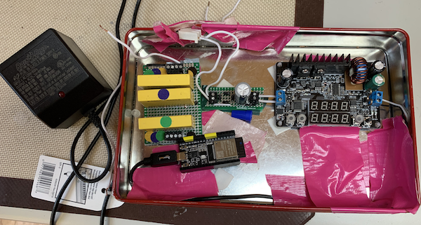

# Intro

And what does May bring? Another year of dappling with irrigation.

## Changes

The biggest change I am making in the 2020 version is to replace the wemos D1 with an ESP32. The wemos D1 is unstable and the wireless antenna is not strong.

# Experience
The waterpuck is an ESP32 controlling three relays connected to the 24VAC lines of an Orbit 3-valve watering system.  The other goop converts the 24VAC down to a 5DC so the ESP32 can use the 24VAC power source.

When the waterpuck starts up, it becomes a web server. The code assumes there is a /lib/wifi.dat file that contains the wifi's ssid;password .

The waterpuck listens for any of these requests:

From any client that can send an URL:
```
http://<TBD IP address:port>/hello
http://<TBD IP address:port>/water_on
http://<TBD IP address:port>/water_off
http://<TBD IP address:port>/water_time=<number of minutes>
http://<TBD IP address:port>/exit_listen
```
For example, a web browser sends
```
http://<TBD IP address:port>/hello
```
The waterpuck sends a message back.
```
Hello - the watering time is set to 15 minutes.
```


# Code Walkthrough

## WaterPuck class

### Initialization

The WaterPuck class takes in a list of gpio pins - one for each of the valves (I currently have an Orbit manifold with three valves in the backyard for example) - and the number of minutes to keep the watering valve open. The default is set by the WATERING_MINS global variable.

```
from waterpuck import WaterPuck
puck = WaterPuck([3,4,5], 5)
```

initializes a WaterPuck representing 3 valves. One valve is connected to GPIO 3, another to GPIO 4, and a third to GPIO 5. Each valve will be turned on for 5 minutes.

The `__init__` method also reads in the wifi's ssid and password from the wifi.dat file that is created when the puck is in wifi AP mode.
## Start Watering
`puck.start_watering()` kicks off turning on and off each valve.

# Connect ESP32 to Mac over USB

To talk with the ESP32 from the Mac, Silicon Lab's CP210x USB to UART Bridge VCP Driver needs to be installed. It's been quite awhile since I installed this...so for me at this point it just works.

- Plug in the ESP32 to a USB port.
- Check to see the /tty/dev is showing up.

```
$ ls /dev/tty.*
/dev/tty.Bluetooth-Incoming-Port        /dev/tty.SLAB_USBtoUART
```

# Install micropython on the ESP32

If the ESP32 does not have micropython installed...
The [micropython downloads page](https://micropython.org/download/#esp32) has the latest available versions of micropython. We went to [the page for generic esp32](https://micropython.org/download/esp32/) and downloaded [`esp32-idf3-20191220-v1.12.bin`](https://micropython.org/resources/firmware/esp32-idf3-20191220-v1.12.bin)

- erase the flash with espressif's esptool:
  `./micropython_install/esptool.py --chip esp32 --port /dev/tty.SLAB_USBtoUART erase_flash`
- Copy micropython:
  `esptool.py --port /dev/tty.wchusbserial1410 --baud 460800 write_flash --flash_size=detect 0 esp8266-20190125-v1.10.bin`
  Note: The port path is unique to the USB port on your mac.

# RSHELL and connect

```
$ rshell
Welcome to rshell. Use Control-D (or the exit command) to exit rshell.

No MicroPython boards connected - use the connect command to add one

> connect serial /dev/tty.SLAB_USBtoUART 115200
Connecting to /dev/tty.SLAB_USBtoUART (buffer-size 512)...
Trying to connect to REPL  connected
Testing if sys.stdin.buffer exists ... Y
Retrieving root directories ... /lib/
Setting time ... May 19, 2020 10:40:33
Evaluating board_name ... pyboard
Retrieving time epoch ... Jan 01, 2000
```

# Check micropython Version

While connected in rshell, go into repl:

```
> repl
Entering REPL. Use Control-X to exit.
>
MicroPython v1.11-47-g1a51fc9dd on 2019-06-19; ESP32 module with ESP32
Type "help()" for more information.
```

# IDE

I'm using VS code. I use a terminal window to get to an rshell connection. I went through this earlier.

## rshell commands

Type `help` to see the rshell commands. Type
`help <command>` to get details on one of the commands. As an example, to get the list of files:

```
>ls /pyboard
lib/
```

shows this board has a lib folder and nothing else in the root.

# GPIO Pins

GPIO pins are used to open/close the valves through the relay.

## ESP32 DevKit C Pinout


# Back Yard

GPIO pins 12, 14, and 27 (see pinout above) work "well" to use for opening/closing each relay switch. I'll also use the GND pin next to pin 12.

# Minimizing Code Size

There isn't much room for code on the esp8266. Most micropython files have two versions:

- _filename_\_verbose.py - no bytes have been removed.
- _filename_.py - file run through [pyminifier](https://liftoff.github.io/pyminifier/). This takes out comments and other bytes that aren't needed to run the code. E.g.:

```
$ pyminifier -o wifimgr.py wifimgr_verbose.py
wifimgr_verbose.py (9271) reduced to 7617 bytes (82.16% of original size)
```

# wemos pinout


# Front yard

The front yard uses only one watering valve. The GPIO pin used is D2 (wemos)= Pin 4 (micropython)

# The back yard

The back yard uses two valves. The "blue" valve is uses GPIO pin D2 (wemos) = Pin 4 (micropython). The "green" valve uses GPIO pin D1 = Pin 5 (micropython).
